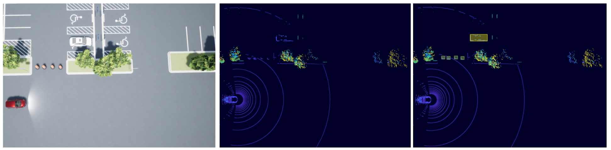
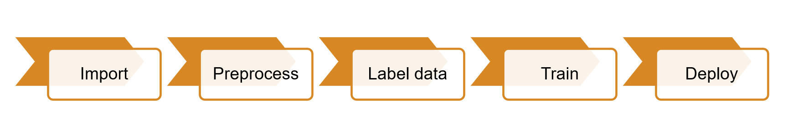
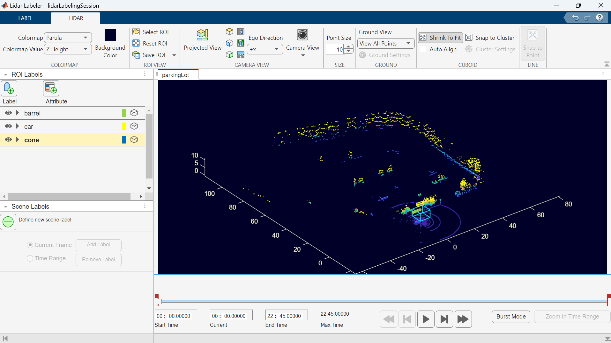

# Deep Learning for 3D Object Detection

This repository serves as a tutorial for training and deploying a 3D object detector using MATLAB® R2024b. It guides you through the processes of data processing, labeling, training, and deploying an object detection model. In this demonstration, simulated LiDAR data is collected from a vehicle navigating a parking lot.

## Getting started

To get started, clone this repo to your local machine and open MATLAB or use this button to open the repository in MATLAB Online:

The repository follows the workflow shown below:

## Project Overview

### Understanding and Processing Point Clouds

This [section](<./1. Import and Process>) covers data exporation and different ways one can preprocess LiDAR data. It gives an introduction to the Lidar Viewer App and explains the different exploration and processing option offered in the app. The file also contains scripts to do the same using MATLAB functions in a programmatic way. 

### Labeling Point Clouds

This [section](<./2. Labeling Point Clouds>) introduces the Lidar Labeler App and walks through the steps to interactively label objects of interest using the app. For this demo, the focus is on labeling cars, construction barrels and cones. The labeled data is then exported to be used for training a deep learning network.

### Deep Learning

The [third section](<./3. Deep Learning with Point Clouds - Training Object Detectors>) goes into detail on training a point pillar network to detect the labeled objects in point clouds. This includes data augmentation, configuring the point pillar network, training and evaluating the results.

### Code Generation

The [final section](<./4. Deploying 3D Object Detectors>) demonstrates how the trained network can be deployed to a target system using MATLAB® Coder™. Two types of deployment are discussed:
- Static library
- ROS Nodes

### Set Up

This project requires the following products:
- [MATLAB®](https://www.mathworks.com/products/matlab.html)
- [Lidar Toolbox™](https://www.mathworks.com/products/lidar.html)
- [Image Processing Toolbox™](https://www.mathworks.com/products/image-processing.html)
- [Computer Vision Toolbox™](https://www.mathworks.com/products/computer-vision.html)
- [Deep Learning Toolbox™](https://www.mathworks.com/products/deep-learning.html)
- [MATLAB® Coder™](https://www.mathworks.com/products/matlab-coder.html)
- [ROS Toolbox](https://www.mathworks.com/products/ros.html)

For questions or clarifications on the code, please contact roboticsarena@mathworks.com

## License
The license is available in the [license.txt](license.txt) file in this GitHub repository.

## Community Support
[MATLAB Central](https://www.mathworks.com/matlabcentral/)

Copyright 2024-2025 The MathWorks, Inc.
